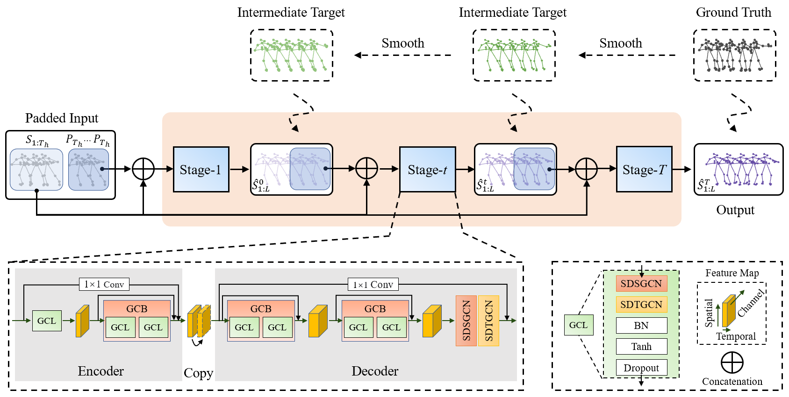

# Progressively-Generating-Better-Initial-Guesses-Towards-Next-Stages-forHigh-Quality-Human-Motion-Prediction


[\[PDF\]](src/04504.pdf)  [\[Supp\]](src/04504-supp.pdf) [\[Demo\]](https://youtu.be/bBLhNwoGjzM)

[comment]: <> ([PDF]&#40;&#41; [Supp]&#40;&#41; [Demo]&#40;&#41;)

[comment]: <> ([\[PDF\]]&#40;assets/07627.pdf&#41;  [\[Supp\]]&#40;assets/07627-supp.pdf&#41;)

## Authors

1. [Tiezheng Ma](https://github.com/705062791), School of Computer Science and Engineering, South China University of Technology, China, [mtz705062791@gmail.com](mailto:mtz705062791@gmail.com)
2. [Yongwei Nie](https://nieyongwei.net), School of Computer Science and Engineering, South China University of Technology, China, [nieyongwei@scut.edu.cn](mailto:nieyongwei@scut.edu.cn)
3. [Chengjiang Long](http://www.chengjianglong.com), Meta Reality Labs, USA, [clong1@fb.com](mailto:clong1@fb.com)
4. [Qing Zhang](http://zhangqing-home.net/), School of Computer Science and Engineering, Sun Yat-sen University, China, [zhangqing.whu.cs@gmail.com](mailto:zhangqing.whu.cs@gmail.com)
5. [Guiqing Li](http://www2.scut.edu.cn/cs/2017/0629/c22284a328097/page.htm), School of Computer Science and Engineering, South China University of Technology, China, [ligq@scut.edu.cn](mailto:ligq@scut.edu.cn)

[comment]: <> (3. [Chengjiang Long]&#40;http://www.chengjianglong.com&#41;, [cjfykx@gmail,com]&#40;mailto:cjfykx@gmail,com&#41;)
## Brief Introduction
**PGBIG** solves the motion prediction problem with a multi-stage prediction framework. In particular, the paper propose to pad the observed sequence with *initial guesses*. For the first stage of prediction, the initial guess is composed of the last observed pose. For all the other stages, the initial guess is the future part of the output of previous stage. The last stage is guided by the ground truth, while all the other stages are guided by the corresponding recursively smoothed results of the ground truth. All the stages use the same Encoder-Copy-Decoder prediction network. 

Encoder-Copy-Decoder is composed of graph convolutional networks(GCN), one for the temporal information extraction(T-GCN) and one for the spatial information extraction(S-GCN). Temporal information is preserved by constructing connected poses from different time step.

## Overview



## Dependencies

Both projects can share one conda environment by running:
```conda env create -f env.yml``` under the ```pose_prediction``` directory.

Tested on an Apple silicon Macbook - an additional update of scipy is required: ```conda install scipy```

## DataSet
[Human3.6m](http://vision.imar.ro/human3.6m/description.php) in exponential map. Download the data in `dataset` folder by running:

``` wget http://www.cs.stanford.edu/people/ashesh/h3.6m.zip ```


## Experiment

**PGBIG**: 
For PGBIG, we are provided with a trained model. 22 joints in expnential map are considered in the training and inferences. The takes only 10 frames and outputs 25 future frames. This makes the dimensionality of single pose $22*3 = 66$.

Run the shell script ```run.sh``` to reproduce experiment. The results are saved in ```pgbig/.``` in csv format. The name of the csv files are in format `{method_name}_eval_{number_of_input_sequences}_{device}_time_{inference time in ms}.csv`

***SINGLE INFERENCE TIME:***
| Action | Time | 
| ----------- | ----------- | 
| walking | 37.82391548156738ms |
| eating | 63.816070556640625ms |
| smoking | 44.82007026672363ms |
| discussion | 44.59095001220703ms |
| directions | 65.08088111877441ms |
| greeting | 62.329769134521484ms |
| phoning | 43.48587989807129ms |
| posing | 41.155099868774414ms |
| purchases | 44.01206970214844ms |
| sitting | 43.86305809020996ms |
| sittingdown | 76.06315612792969ms |
| takingphoto | 43.82586479187012ms |
| waiting | 39.53409194946289ms |
| walkingdog | 41.59426689147949ms |
| walkingtogether | 41.059017181396484ms |


**Note**: 
+ `cuda_idx`: is the seleced device to run on `{cpu, cuda:0}`.
  
+ `test_sample_num`: is the sample number for test dataset, can be set as `{8, 256, -1(all)}`. For example, if it is set to `8`, it means that 8 samples are sampled for each action as the test set. 

## Citation

If you think our work is helpful to you, please cite our paper.

```
Ma T, Nie Y, Long C, et al. Progressively Generating Better Initial Guesses Towards Next Stages for High-Quality Human Motion Prediction[C]//Proceedings of the IEEE/CVF Conference on Computer Vision and Pattern Recognition. 2022: 6437-6446.

```

[comment]: <> (```)

[comment]: <> (@inproceedings{lingwei2021msrgcn,)

[comment]: <> (  title={MSR-GCN: Multi-Scale Residual Graph Convolution Networks for Human Motion Prediction},)

[comment]: <> (  author={Lingwei, Dang and Yongwei, Nie and Chengjiang, Long and Qing, Zhang and Guiqing Li},)

[comment]: <> (  booktitle={Proceedings of the IEEE International Conference on Computer Vision &#40;ICCV&#41;},)

[comment]: <> (  year={2021})

[comment]: <> (})

[comment]: <> (```)

## Acknowledgments
Our code is based on [HisRep](https://github.com/wei-mao-2019/HisRepItself) and [LearnTrajDep](https://github.com/wei-mao-2019/LearnTrajDep)

[comment]: <> (Some of our evaluation code and data process code was adapted/ported from [LearnTrajDep]&#40;https://github.com/wei-mao-2019/LearnTrajDep&#41; by [Wei Mao]&#40;https://github.com/wei-mao-2019&#41;. )

## Licence
MIT
