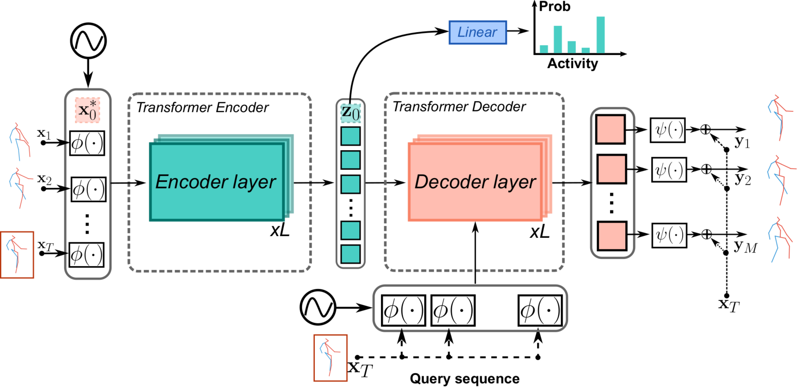

# Pose Transformers: Human Motion Prediction with Non-Autoregressive Transformers

## Brief introduction
**POTR** solves the motion prediction problem in with seq2seq approach inspired by NLP tasks. The architecture proposed in the paper consists of two graph convolutional networks($\phi$ and $\psi$) and a pose transformer. In an inference process, the pose sequence is firstly fed into $\phi$ and then the encoder transformer block. The encoded sequence is then an input to decoder transformer block together with the query sequence. Finally, the predicted sequence is generated with network $\psi$ in a residual fashion. 

The aim of the $\phi$ and $\psi$ networks is to model the spatial relationships between the different elements of the body structure. And the transformer blocks should capture the spatial-temporal features of the sequence. This architecture is trained jointly on the seq2seq task and an action classification task by adding an extra classification token to the initial pose sequence.





This is the repo used for human motion prediction with non-autoregressive
transformers published with our [paper](https://openaccess.thecvf.com/content/ICCV2021W/SoMoF/papers/Martinez-Gonzalez_Pose_Transformers_POTR_Human_Motion_Prediction_With_Non-Autoregressive_Transformers_ICCVW_2021_paper.pdf)


## Requirements

* **Pytorch**>=1.7.
* **Numpy**.
* **Tensorboard** for pytorch.

## Data

We have performed experiments with **H36M**

The data required is already downloaded and transformed to the correct format in ```data```.

**Note**. You can download the H36M dataset using ```wget http://www.cs.stanford.edu/people/ashesh/h3.6m.zip```.
However, the code expects files to be **npy** files instead of **txt**.
You can use the script in ```data/h36_convert_txt_to_numpy.py``` to convert to ***npy*** files.

## Experiment

**POTR**: For POTR, the trained model is not provided by the authors. Thus a new model is trained with the their hyper-parameters on a NVIDIA GeForce RTX3080 and checkpoint 0499 is used. The model takes 50 frames, and output 25 frames of 1s motion. For each sequence in the training and evaluation, only a set of 21 key joints considered. Then the sequences are trained in rotation matrix representations which makes the dimensionality of single pose $21*3*3=189$. (MAJOR_JOINTS = $[ 0, 1, 2, 3, 4, 6, 7, 8, 9, 11, 12, 13, 14, 16, 17, 18, 19, 24, 25, 26, 27]$)


To run evaluation with H3.6M dataset and save experiment csv results in current folder, run the following:

```
python training/experiment.py
```

The name of the csv files are in format `{method_name}_eval_{number_of_input_sequences}_{device}_time_{inference time in ms}.csv`. The configuration used here is in ```./h36out/config.json```. 


# Citation

If you happen to use the code for your research, please cite the following paper

```
@inproceedings{Martinez_ICCV_2021,
author = "Mart\'inez-Gonz\'alez, A. and Villamizar, M. and Odobez, J.M.",
title = {Pose Transformers (POTR): Human Motion Prediction with Non-Autoregressive Transformers},
booktitle = {IEEE/CVF International Conference on Computer Vision - Workshops (ICCV)},
year = {2021}
}
```


